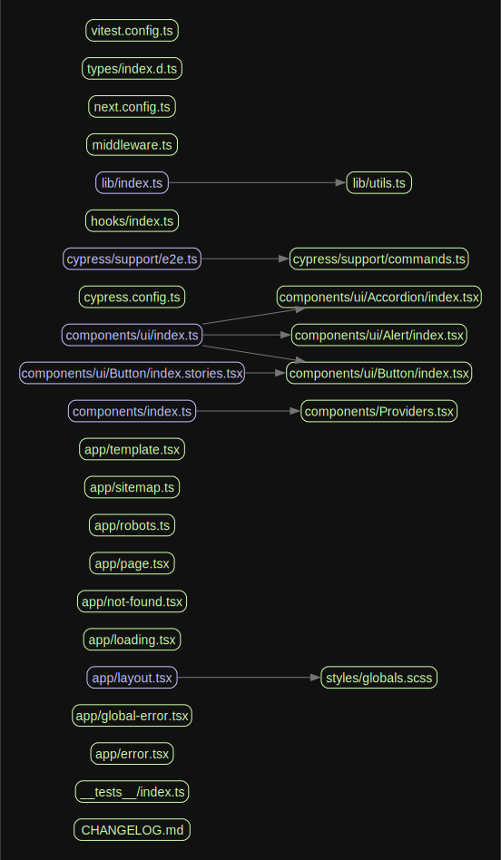

# Nextjs Structure

Welcome to our Next.js boilerplate, a powerful foundation for building modern web applications with speed and reliability. Designed to streamline your development process, our boilerplate combines the most popular and useful tools in the industry, allowing you to hit the ground running and focus on creating exceptional user experiences. With Next.js at its core, you'll benefit from server-side rendering, automatic code splitting, and seamless routing, empowering you to build performant and scalable applications. Additionally, we've integrated a comprehensive set of tools and configurations to enhance productivity, maintain code quality, and ensure robustness. Let's dive in and unleash your full development potential with our feature-packed Next.js boilerplate.

## Features

- **Next.js** - Minimalistic framework for server-rendered React applications.
- **Tailwind CSS** - Highly customizable, low-level CSS framework that gives you all of the building blocks you need to build bespoke designs.
- **Shadcn** - A set of components and hooks that are designed to be composable, customizable, and accessible.
- **TypeScript** - Superset of JavaScript that provides optional static typing and powerful tooling.
- **ESLint** - Pluggable JavaScript linter that helps you avoid errors and enforce conventions in your styles.
- **Prettier** - Opinionated code formatter that ensures your code is easy to read.
- **Storybook** - Development environment for UI components that allows you to browse a component library, view the different states of each component, and interactively develop and test components.
- **Tanstack Query** - Powerful data-fetching library for React applications that simplifies data management and synchronization.
- **Vitest** - Go beyond testing with this next-generation frontend dev server
- **Zod** - TypeScript-first schema declaration and validation library.
- **Coupling Graph** - Developer tool for generating a visual graph of your module dependencies, finding circular dependencies, and give you other useful info.
- **Bundle Analyzer** - Visualize the size of webpack output files with an interactive zoomable treemap.
- **T3 Environment** - Environment variables management for Next.js applications.
- **Cross Env** - Cross-platform environment variables management.
- **Conventional Commits** - Specification for adding human and machine readable meaning to commit messages.

## Coupling Graph

